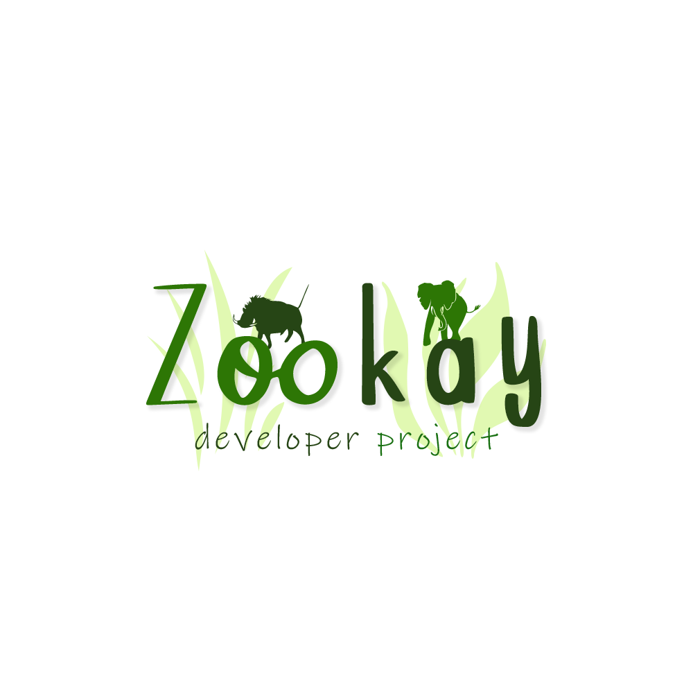

<!-- PROJECT SHIELDS -->
<!--
*** I'm using markdown "reference style" links for readability.
*** Reference links are enclosed in brackets [ ] instead of parentheses ( ).
*** See the bottom of this document for the declaration of the reference variables
*** for contributors-url, forks-url, etc. This is an optional, concise syntax you may use.
*** https://www.markdownguide.org/basic-syntax/#reference-style-links
-->


<!-- PROJECT LOGO -->
<br />
<div align="center">
  <a href=" ">
    
  </a>

  <h3 align="center">The Zoo Kay</h3>

  <p align="center">
    This project has a lot of animals!
    <br />
    <a href="https://docs.google.com/document/d/1A21MRgBKKfpAjtRJtAEEViYRl7eNvdMIo8tBW94bHmk/edit?usp=sharing"><strong>Explore the docs »</strong></a>
    <br />
    <br />
    <a href="#about-the-project">View Demo</a>
    ·
    <a href="https://github.com/ProjectSWP1/Zoo-Application/issues/new">Report Bug</a>
    ·
    <a href="https://github.com/ProjectSWP1/Zoo-Application/issues">Request Feature</a>
  </p>
</div>


<!-- TABLE OF CONTENTS -->
<details>
  <summary>Table of Contents</summary>
  <ol>
    <li>
      <a href="#about-the-project">About The Project</a>
      <ul>
        <li><a href="#built-with">Built With</a></li>
      </ul>
    </li>
    <li>
      <a href="#getting-started">Getting Started</a>
      <ul>
        <li><a href="#prerequisites">Prerequisites</a></li>
        <li><a href="#installation">Installation</a></li>
      </ul>
    </li>
    <li><a href="#usage">Usage</a></li>
    <li><a href="#roadmap">Roadmap</a></li>
    <li><a href="#contributing">Contributing</a></li>
    <li><a href="#license">License</a></li>
    <li><a href="#contact">Contact</a></li>
    <li><a href="#acknowledgments">Acknowledgments</a></li>
  </ol>
</details>


<!-- ABOUT THE PROJECT -->
## About The Project


The Zoo Kay is a zoo project with a focus on showcasing a wide variety of animal species. Moreover, this web application is held for the Admin, Staff, and Zoo Trainer to manage their zoo more easily. Not only for management, but the guest can also book a ticket online to visit the zoo. The guest can also become a member by registering an account and then verifying the email. Every time they have bought a ticket or some events are going to be organized in the zoo, members can get free vouchers and so on...!

Free to become a Member, and even you get a voucher to have a discount on buying a ticket! Amazing right?

<p align="right">(<a href="#readme-top">back to top</a>)</p>


### Built With

* [![React][React.js]][React-url]
* [![Bootstrap][Bootstrap.com]][Bootstrap-url]
* [![Hibernate][Hibernate-shield]][Hibernate-url]
* [![PHP][PHP-shield]][PHP-url]
* [![Spring][Spring-shield]][Spring-url]
* [![NodeJS][Nodejs-shield]][Nodejs-url]
* [![MySQL][mysql-shield]][mysql-url]

<p align="right">(<a href="#readme-top">back to top</a>)</p>


<!-- GETTING STARTED -->
## Getting Started

To get a local copy up and running, follow these simple steps:

### Prerequisites

* npm
  ```sh
  npm install npm@latest -g

### Installation

Clone the repo
   ```sh
   git clone https://github.com/ProjectSWP1/Zoo-Application.git
   ```

<p align="right">(<a href="#readme-top">back to top</a>)</p>

<!-- ROADMAP -->
## Roadmap

- [x] Add Changelog
- [x] Add back to top links
- [x] Add "components" document to easily copy & paste sections of the readme
- [x] Design Web pages project then upload to git
- [x] Create management repositories for Admin
- [x] Create management repositories for Staff
- [x] Create register/login account
- [x] Buy ticket function and prepare payment
- [ ] Fully connect to FrontEnd Code (ReactJS)
- [ ] Clean code
- [ ] Deploy on Azure
- [ ] Multi-language Support
    - [ ] English
    - [ ] Japanese

<p align="right">(<a href="#readme-top">back to top</a>)</p>


<!-- CONTRIBUTING -->
## Contributing

Contributions are what make the open source community such an amazing place to learn, inspire, and create. Any contributions you make are **greatly appreciated**.

If you have a suggestion that would make this better, please fork the repo and create a pull request. You can also simply open an issue with the tag "enhancement".
Don't forget to give the project a star! Thanks again!

1. Fork the Project
2. Create your Feature Branch (`git checkout -b feature/AmazingFeature`)
3. Commit your Changes (`git commit -m 'Add some AmazingFeature'`)
4. Push to the Branch (`git push origin feature/AmazingFeature`)
5. Open a Pull Request

<p align="right">(<a href="#readme-top">back to top</a>)</p>


<!-- LICENSE -->
## License

Distributed under the MIT License. See `LICENSE.txt` for more information.

<p align="right">(<a href="#readme-top">back to top</a>)</p>


<!-- CONTACT -->
## Contact

Le Thanh Hai - [@my_facebook](https://www.facebook.com/hailedeeptry/) - lehai112003@gmail.com

Lam Le Nhan - lmnhn995@gmail.com

Project Link: [https://github.com/ProjectSWP1/Zoo-Application](https://github.com/ProjectSWP1/Zoo-Application)

<p align="right">(<a href="#readme-top">back to top</a>)</p>


<!-- MARKDOWN LINKS & IMAGES -->
<!-- https://www.markdownguide.org/basic-syntax/#reference-style-links -->
[product-screenshot]: images/screenshot.png
[React.js]: https://img.shields.io/badge/React-20232A?style=for-the-badge&logo=react&logoColor=61DAFB
[React-url]: https://reactjs.org/
[Bootstrap.com]: https://img.shields.io/badge/Bootstrap-563D7C?style=for-the-badge&logo=bootstrap&logoColor=white
[Bootstrap-url]: https://getbootstrap.com
[Hibernate-shield]: https://img.shields.io/static/v1?style=for-the-badge&message=Hibernate&color=59666C&logo=Hibernate&logoColor=FFFFFF&label=
[Hibernate-url]: https://hibernate.org/
[PHP-shield]: https://img.shields.io/static/v1?style=for-the-badge&message=PHP&color=777BB4&logo=PHP&logoColor=FFFFFF&label=
[PHP-url]: https://www.php.net/
[Spring-shield]: https://img.shields.io/static/v1?style=for-the-badge&message=Spring&color=6DB33F&logo=Spring&logoColor=FFFFFF&label=
[Spring-url]: https://spring.io/
[Nodejs-shield]: https://img.shields.io/static/v1?style=for-the-badge&message=Node.js&color=339933&logo=Node.js&logoColor=FFFFFF&label=
[Nodejs-url]: https://nodejs.org/en
[mysql-shield]: https://img.shields.io/static/v1?style=for-the-badge&message=MySQL&color=4479A1&logo=MySQL&logoColor=FFFFFF&label=
[mysql-url]: https://www.mysql.com/
